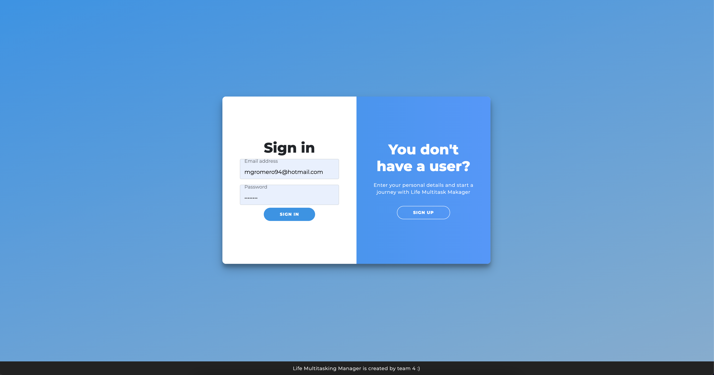
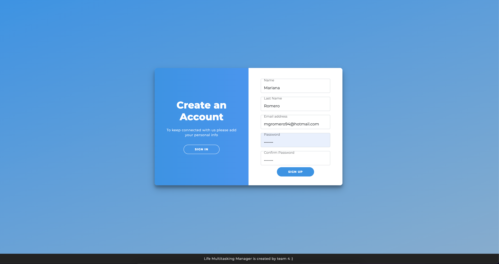
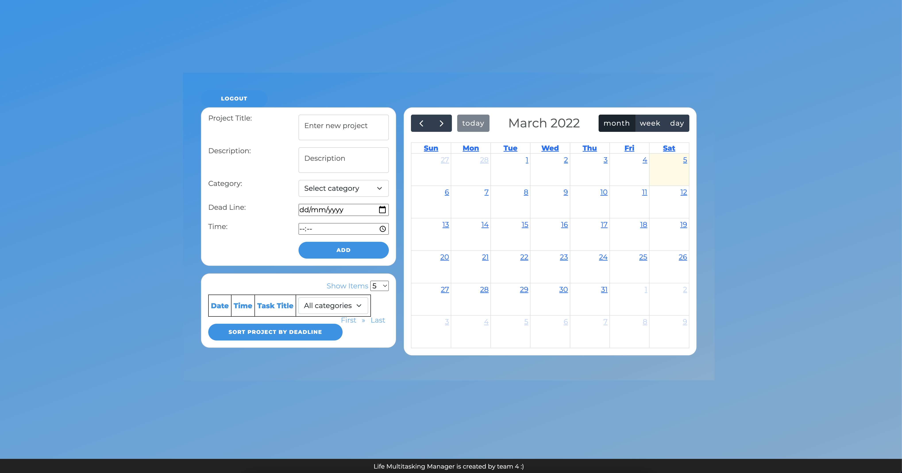
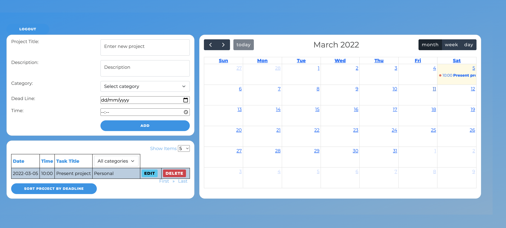
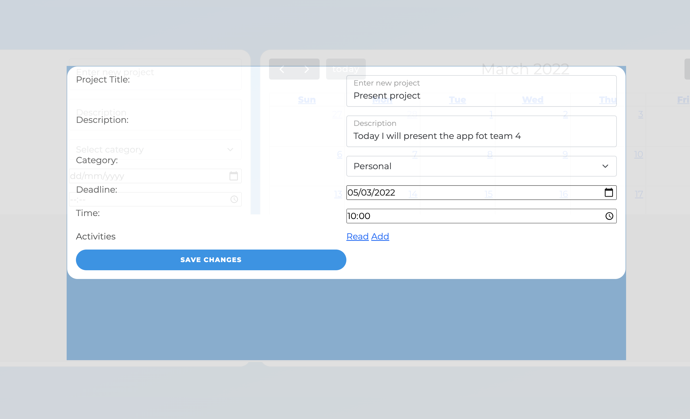
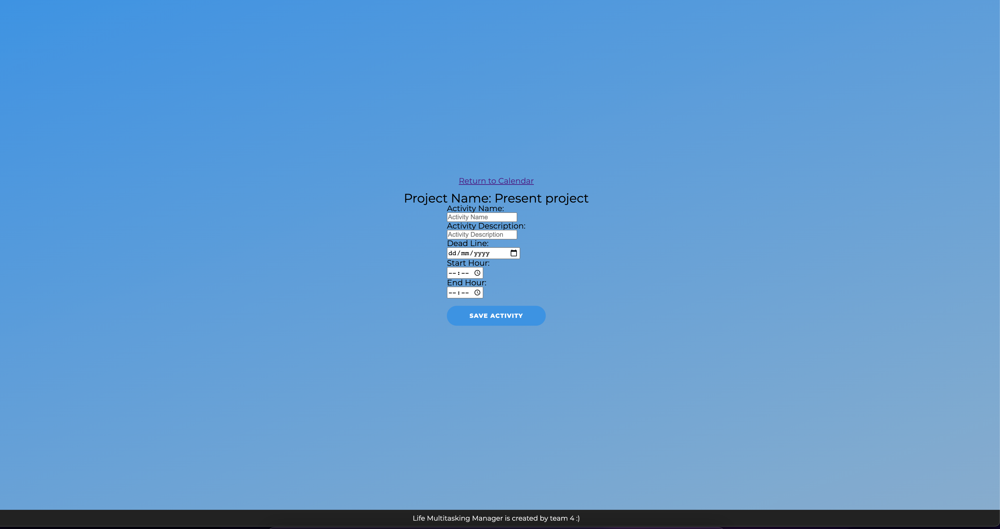
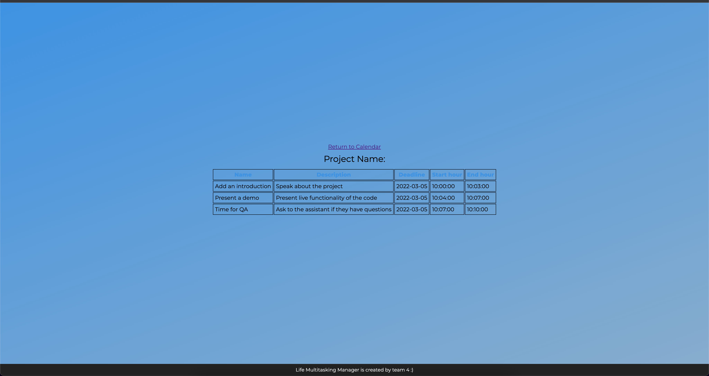
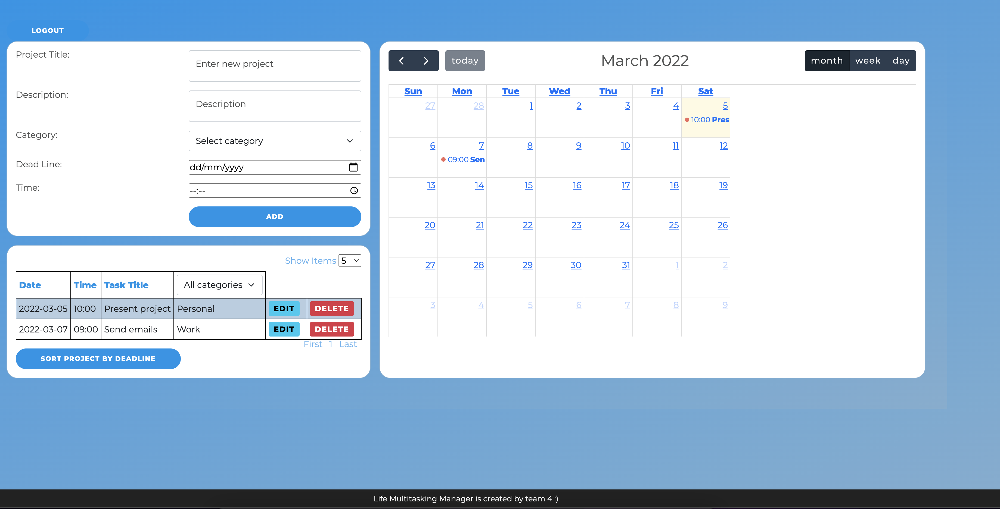

# Project-2-team-4
## Description of the Project

This is an application to add different events/project for manage your time.
You schedule one event and create different activities to it, and be reflected on your calendar.
You can see your events and filtered by category

The technologies used in this project are:

- Vanilla Javascript
- Handlebars as template engine (https://handlebarsjs.com/)
- Bootstrap as a CSS framework (https://getbootstrap.com/)
- FullCalendar for the calendar displayed (https://fullcalendar.io/)
- Sequelize as ORM (https://sequelize.org/)
- Mysql as DB (https://www.mysql.com/)
- Heroku as PAS (https://heroku.com)
- NodeJS and ExpressJS as backend libraries (https://nodejs.org/en/ &&  http://expressjs.com/)


The devolopers involve in this project are:

- Mariana Gonzalez Romero
- Daniel Alejandro Moreno Garza
- Jorge Alejandro Bernal Vázquez
- Mario Alberto Colunga Villatoro
- Marco Antonio Gonzalez Guzman

## User Story

```
AS A user
I WANT to add events
SO THAT I can manage my time
SO THAT I track my events
I WANT add different activities in my events
SO THAT I can organize better my time
```

## Acceptance Criteria

```
WHEN I am presented with the login page
THEN I can create a new user
THEN I can login with my credentials
THEN I see the dashboard with my calendar
THEN I create an event
GIVEN an event I can see the event displayed in the calendar
THEN I can edit the event and add activities
THEN I create an activity for the event
THEN I can see all the activities for the events
WHEN I press LOGOUT  button I logged out from the app.
```

## Mock-Up

The following image shows the web application's appearance and functionality:

- Login page
  
  

- Calendar page
  

- Calendar with event added
  

- Edit event and add activities
  
  
  

  - See all events
  